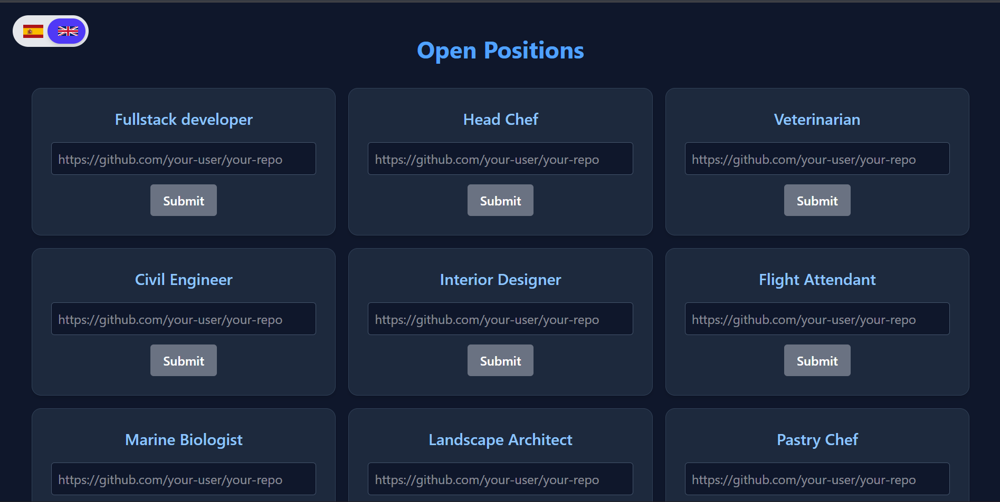

# Challenge – Junior FullStack Developer  
## Nimble Gravity




## 🌐 Live Demo

https://nimble-gravity-test.vercel.app/

## 📌 Overview

This project was developed as part of a technical challenge for the **Junior FullStack Developer** position at **Nimble Gravity**.

The application connects to the API provided by Nimble Gravity to retrieve candidate information and allows users to apply for available positions. Additionally, it integrates with the public GitHub API to validate repository existence before submission.

The project emphasizes:

- Clean architecture  
- Reusable components  
- Proper state management  
- User experience (UX) improvements  
- Scalable internationalization  

## 🛠 Tech Stack

- **React**
- **Vite**
- **Tailwind CSS**
- **Axios**
- **react-i18next**

## ✨ Features

- 🌐 Integration with Nimble Gravity API  
- 🔎 GitHub repository validation (GitHub Public API)  
- 🌍 Internationalization (English / Spanish)  
- 🚨 Global Alert system (Context API)  
- ⏳ Global Loader overlay  
- 🔐 Environment variable configuration  
- 🎨 Responsive UI with Tailwind CSS  

## 🌍 Internationalization

The application supports:

- 🇺🇸 English  
- 🇪🇸 Spanish  

Implemented using **react-i18next**, allowing dynamic translation variables and scalable language expansion.

## 🔎 GitHub Repository Validation

Before submitting an application, the system:

1. Validates the GitHub repository URL format.
2. Checks repository existence via GitHub’s public API.
3. Displays contextual feedback using the global alert system.

## ⚙️ Environment Variables

Create a `.env` file in the project root:

```env
VITE_BASE_URL=your_api_base_url
VITE_PERSONAL_EMAIL=your_email_here
```
These variables are required for:

* Connecting to Nimble Gravity API
* Including applicant contact information

information

## 📦 Installation

Clone the repository:

```bash
git clone https://github.com/your-username/your-repository.git
cd your-repository
```

Install dependencies:

```bash
npm install
```

Run development server:

```bash
npm run dev
```

Build for production:

```bash
npm run build
```

## 📂 Project Structure (Simplified)

```
src/
 ├── api/
 ├── components/
 ├── context/
 ├── i18n/
 |     └── locales/
 ├── pages/
 ├── services/
 ├── pages/
 ├── services/
 └── App.jsx
```

## 🧠 Architectural Highlights

* Context API for global state management (Alert & Loader)
* Centralized Axios instance configuration
* Clear separation between UI, services, and state
* Reusable components
* Scalable i18n setup
* Clean and maintainable folder structure

## 📄 License

This project is licensed under the MIT License.

## 👤 Author

Jesus Ramon Alexis Cruz - Junior FullStack Developer

Focused on scalable frontend architecture, API integration, and clean code principles.
